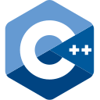

<h1 align="center">👋 Hello! I'm Vedabahu. </h1>
<!-- <h3 style="text-align: center;">I am a software engineer, studying at <a href="https://iiitdwd.ac.in/" alt="IIIT Dharwad" target="_blank">IIIT Dharwad</a></h3> -->
<!-- 
 -->

- I am a second year, computer science student at [IIIT Dharwad](https://iiitdwd.ac.in/)
- I am interested in [Quantum Computing](https://aws.amazon.com/what-is/quantum-computing/) and web development.

## Languages

          
          
          

## Tools that I generally use

## Contact me

